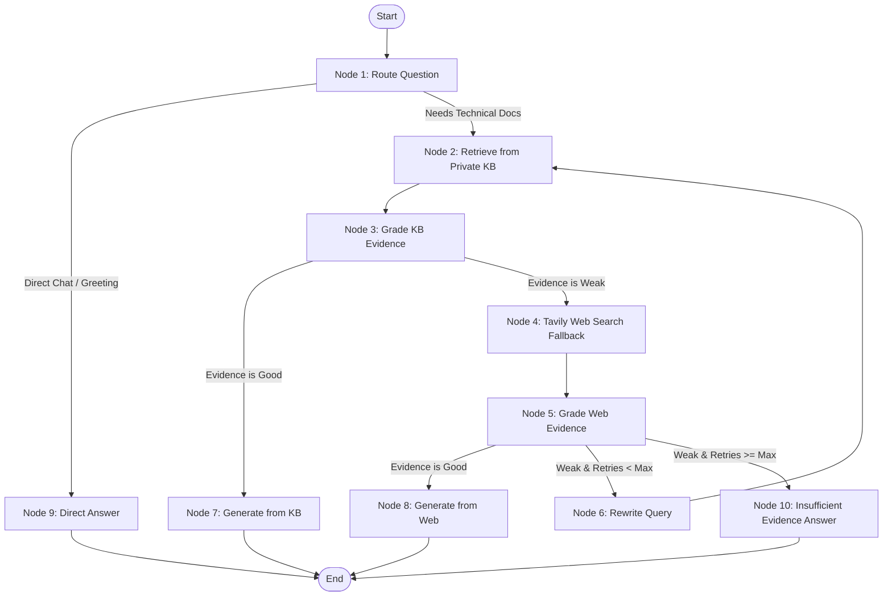

# 🧠 Production-Grade Agentic RAG with LangGraph, Groq, Pinecone & Tavily

An industry-standard **Agentic Retrieval-Augmented Generation (Agentic RAG)** system built with **LangGraph**, **LangChain**, **Groq LLM**, **Pinecone Vector Database**, and **Tavily Web Search**.

Unlike traditional static RAG pipelines that blindly retrieve and generate, this system acts autonomously with **semantic query routing**, **document relevance grading**, **self-correcting query rewriting**, and an **automatic web search fallback** when internal documents are insufficient or outdated.

---

## 🌟 Key Features

- **Dynamic Query Routing**: Intelligently categorizes questions to decide whether retrieval is required (`kb`) or if a direct conversational response is appropriate (`direct`), cutting latency and API costs.
- **Two-Tier Evidence Grading**: Uses structured LLM evaluation to verify whether retrieved knowledge base documents are adequate to answer the query.
- **Automated Web Fallback**: Seamlessly queries Tavily Web Search if the internal knowledge base does not contain relevant or sufficient evidence.
- **Self-Correction & Query Rewriting**: If retrieved web results are weak, the agent reformulates the query and retries retrieval up to a configurable maximum retry limit (default: 2 retries).
- **Hallucination Mitigation**: Prompts strictly instruct the model to ground its responses exclusively in retrieved context and disclose the source (`Private KB` or `Web Search` with references/URLs).
- **Graceful Failure Handling**: If neither private docs nor web search yield sufficient evidence, the agent informs the user instead of hallucinating.

---

## 🏗️ Architecture & Workflow

The pipeline is modeled as a state machine using **LangGraph**:



### Graph Nodes Overview

| # | Node | Purpose |
|---|------|---------|
| **1** | `route_question` | Evaluates user query to decide between private KB retrieval or direct response. |
| **2** | `retrieve_kb` | Queries Pinecone vector store using sentence-transformer embeddings (top-4 chunks). |
| **3** | `grade_kb_evidence` | Evaluates retrieved KB chunks with structured JSON output (`good` / `weak`). |
| **4** | `search_web` | Fallback search via Tavily Search API for real-time web context. |
| **5** | `grade_web_evidence` | Assesses quality and relevance of web search snippets (`good` / `weak`). |
| **6** | `rewrite_query` | Optimizes and reformulates the user query for higher retrieval quality. |
| **7** | `generate_from_kb` | Produces an answer grounded strictly in private knowledge base documents. |
| **8** | `generate_from_web` | Produces an answer grounded in web search results, including source links. |
| **9** | `direct_answer` | Fast, lightweight responses for greetings and general chitchat. |
| **10** | `answer_insufficient` | Transparent fallback response when evidence is incomplete or missing. |

---

## 🛠️ Tech Stack

- **Orchestration**: [LangGraph](https://github.com/langchain-ai/langgraph), [LangChain Core](https://github.com/langchain-ai/langchain)
- **LLM Engine**: [Groq](https://groq.com/) (`ChatGroq`) for ultra-low latency inference
- **Vector Database**: [Pinecone](https://www.pinecone.io/) (Serverless index on AWS, cosine distance metric)
- **Embeddings**: `sentence-transformers/all-MiniLM-L6-v2` (384 dimensions) via [HuggingFace](https://huggingface.co/)
- **Web Search**: [Tavily AI Search](https://tavily.com/) (`langchain-tavily`)
- **Document Loading & Chunking**: `WebBaseLoader`, `RecursiveCharacterTextSplitter`
- **Configuration & Validation**: `Pydantic`, `python-dotenv`

---

## 📂 Project Structure

```text
Agentic-Rag/
├── Agentic_Rag.ipynb     # Complete notebook implementing the end-to-end Agentic RAG pipeline
├── requirements.txt      # Python dependencies
├── .env.example          # Environment variables template
├── .gitignore            # Git exclusion rules for API keys and venv
└── README.md             # Project documentation
```

---

## 🚀 Getting Started

### 1. Clone the Repository

```bash
git clone <YOUR_GITHUB_REPO_URL>
cd Agentic-Rag
```

### 2. Create and Activate Virtual Environment

**Windows (Command Prompt / PowerShell):**
```bash
python -m venv .venv
# PowerShell
.venv\Scripts\Activate.ps1
# or Command Prompt
.venv\Scripts\activate.bat
```

**Linux / macOS:**
```bash
python3 -m venv .venv
source .venv/bin/activate
```

### 3. Install Dependencies

```bash
pip install --upgrade pip
pip install -r requirements.txt
```

### 4. Configure Environment Variables

Copy [.env.example](file:///c:/Users/Vishal/Desktop/projects/Agentic-Rag/.env.example) to `.env`:

```bash
cp .env.example .env
```

Open `.env` and fill in your API credentials:

```dotenv
GROQ_API_KEY="gsk_..."
TAVILY_API_KEY="tvly-..."
PINECONE_API_KEY="pcsk_..."
```

> [!IMPORTANT]
> Keep your `.env` file secure! It is already added to [.gitignore](file:///c:/Users/Vishal/Desktop/projects/Agentic-Rag/.gitignore) to prevent accidental credential commits.

---

## 🧪 Usage & Interactive Execution

Launch Jupyter Notebook or Jupyter Lab:

```bash
jupyter notebook Agentic_Rag.ipynb
```

### Example Invocations

#### Scenario A: Direct Greeting (Bypasses Retrieval)
```python
ask_agent("Hello, how are you?")
# Output:
# [Router] direct
# SOURCE USED: direct
# FINAL ANSWER: Hi! I'm doing well, thanks. How about you?
```

#### Scenario B: Query Covered by Private KB
```python
ask_agent("How to build a custom RAG agent with LangGraph?")
# Output:
# [Router] kb
# [KB Retriever] Retrieved: 4 chunks
# [KB Grader] good
# SOURCE USED: private_kb
# FINAL ANSWER: [Structured walkthrough with source attribution]
```

#### Scenario C: Query Outside Private KB (Auto Web Fallback)
```python
ask_agent("What is Tavily Search and why is it useful for AI agents and RAG workflows?")
# Output:
# [Router] kb
# [KB Retriever] Retrieved: 4 chunks
# [KB Grader] weak
# [Tavily Search] Query: What is Tavily Search...
# [Web Grader] good
# SOURCE USED: web_search
# FINAL ANSWER: [Comprehensive explanation with citations and URLs]
```

---

## 📈 State Representation

The agent operates across a typed state dictionary defined as:

```python
from typing import List
from typing_extensions import TypedDict
from langchain_core.documents import Document

class AgentState(TypedDict):
    question: str          # Original question from the user
    current_query: str     # Query string (updated if rewritten)
    kb_docs: List[Document]# Retrieved chunks from Pinecone
    web_results: str       # Formatted results from Tavily Search
    kb_grade: str          # "good" or "weak" evaluation for KB docs
    web_grade: str         # "good" or "weak" evaluation for Web docs
    answer: str            # Final compiled response
    source_used: str       # "private_kb" | "web_search" | "direct" | "insufficient_evidence"
    retry_count: int       # Number of query rewrites executed
```

---

## 🛡️ License

This project is open-source and available under the [MIT License](LICENSE).
