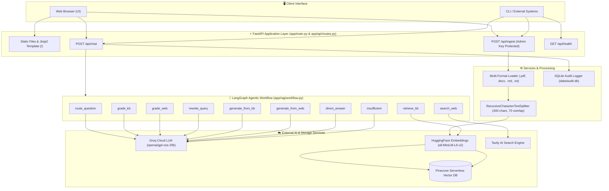
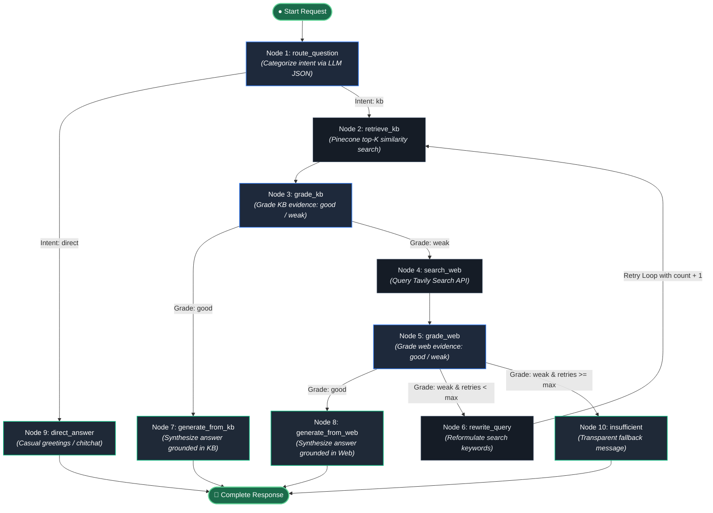
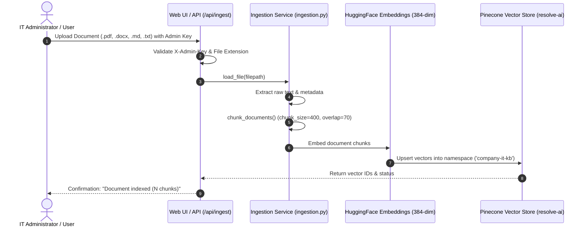

# 🛡️ ResolveAI — Enterprise IT Support Agentic RAG Platform

[](https://www.python.org/)
[](https://fastapi.tiangolo.com/)
[](https://github.com/langchain-ai/langgraph)
[](https://groq.com/)
[](https://www.pinecone.io/)
[](https://tavily.com/)
[](LICENSE)

**ResolveAI** is a production-grade, autonomous **Agentic Retrieval-Augmented Generation (Agentic RAG)** platform engineered specifically for enterprise IT support and knowledge operations. 

Unlike brittle "naive RAG" pipelines that blindly retrieve chunks and hallucinate when documents are absent, ResolveAI operates as an intelligent cyclical state machine powered by **LangGraph**, **Groq LLM** (`openai/gpt-oss-20b`), **Pinecone Vector DB**, and **Tavily Web Search**. It implements dynamic semantic routing, two-tier evidence grading, self-correcting query reformulation loops, automated real-time web search fallback, audit trail logging, and a responsive web application featuring live agent execution traces.

---

## 📑 Table of Contents

- [🌟 Core Highlights](#-core-highlights)
- [⚖️ Architecture Comparison: Naive RAG vs. ResolveAI](#️-architecture-comparison-naive-rag-vs-resolveai)
- [🏗️ System Architecture & Workflow](#️-system-architecture--workflow)
  - [1. End-to-End System Architecture](#1-end-to-end-system-architecture)
  - [2. LangGraph Decision State Machine](#2-langgraph-decision-state-machine)
  - [3. Document Ingestion & Vector Indexing Flow](#3-document-ingestion--vector-indexing-flow)
- [🧩 LangGraph State Machine Specification](#-langgraph-state-machine-specification)
  - [Agent State Schema](#agent-state-schema)
  - [Node Execution & Routing Matrix](#node-execution--routing-matrix)
  - [Evidence Grading Decision Policy](#evidence-grading-decision-policy)
- [🛠️ Technology Stack](#️-technology-stack)
- [📁 Project Structure](#-project-structure)
- [🔌 REST API Reference](#-rest-api-reference)
  - [Endpoints Overview](#endpoints-overview)
  - [API Schema & Payloads](#api-schema--payloads)
- [💾 Data Storage & Audit Logging](#-data-storage--audit-logging)
- [⚙️ Configuration & Environment Variables](#️-configuration--environment-variables)
- [🚀 Quickstart & Installation](#-quickstart--installation)
  - [1. Clone Repository](#1-clone-repository)
  - [2. Set Up Virtual Environment](#2-set-up-virtual-environment)
  - [3. Install Dependencies](#3-install-dependencies)
  - [4. Configure Environment Variables](#4-configure-environment-variables)
  - [5. Seed Sample Knowledge Base](#5-seed-sample-knowledge-base)
  - [6. Launch the Application](#6-launch-the-application)
- [🧪 Scenario Walkthroughs & Execution Traces](#-scenario-walkthroughs--execution-traces)
- [🔒 Production Safeguards & Guardrails](#-production-safeguards--guardrails)
- [📄 License](#-license)

---

## 🌟 Core Highlights

- **Dynamic Query Intent Routing**: Classifies queries before performing costly embeddings or vector searches. Conversational greetings and general queries bypass retrieval entirely (`direct`), saving compute and reducing response latency to sub-second speeds.
- **Strict Two-Tier Evidence Grading**: Uses structured LLM evaluators (`json_mode`) to evaluate both internal Pinecone chunks and Tavily web results. Answers are only generated if evidence directly and reliably answers the user's specific problem.
- **Autonomous Web Fallback**: When company-internal runbooks and policies lack relevant context (e.g., questions regarding third-party vendor outages, external API docs, or broad software bugs), the agent seamlessly pivots to Tavily AI Search.
- **Self-Correction & Query Reformulation**: If web evidence is initially rated as `weak`, the system automatically rewrites the query with technical search keywords and retries retrieval up to a configurable threshold (`max_retries = 2`).
- **Complete Hallucination Mitigation**: Enforces strict grounding rules in prompt templates. Answers are explicitly tagged with their respective source origin (`private_kb`, `web_search`, `direct`, or `insufficient_evidence`) alongside source citations.
- **Full-Stack Application & Live Traces**: Complete with a FastAPI REST backend, a responsive dark-mode web console, and a live step-by-step agent trace visualizer so users and admins can inspect every routing and grading decision in real time.
- **Multi-Format Ingestion Engine**: Built-in support for uploading and indexing `.pdf`, `.docx`, `.txt`, and `.md` runbooks with automated chunking and Pinecone vector store synchronization.
- **Enterprise Audit Logging**: Persists every interaction, query, final source used, and complete LangGraph execution trace into SQLite (`data/audit.db`) for compliance, telemetry, and debugging.

---

## ⚖️ Architecture Comparison: Naive RAG vs. ResolveAI

| Capability | Naive / Traditional RAG | ResolveAI Agentic RAG |
| :--- | :--- | :--- |
| **Query Routing** | ❌ None — Blindly embeds & retrieves for all queries | ✅ **Intelligent routing** — Separates chat from IT knowledge queries |
| **Evidence Validation** | ❌ None — Passes top-K chunks to LLM regardless of relevance | ✅ **Structured LLM grading** — Evaluates chunk adequacy before generation |
| **External Knowledge** | ❌ Blind spot — Completely fails if docs are not in vector DB | ✅ **Autonomous web search** — Fallback to Tavily AI Search |
| **Self-Correction** | ❌ Single-pass — Static failure if query is poorly phrased | ✅ **Query rewriting loop** — Reformulates query and retries retrieval |
| **Hallucination Guardrails** | ⚠️ High risk — LLM guesses when retrieved chunks are partial | ✅ **Strict grounding** — Acknowledges insufficient evidence transparently |
| **Observability** | ❌ Black box generation | ✅ **Live execution trace** — Full decision transparency in UI and SQLite |
| **Document Ingestion** | ⚠️ Often batch scripts only | ✅ **On-the-fly ingestion** — REST endpoint & web UI modal with API key auth |

---

## 🏗️ System Architecture & Workflow

### 1. End-to-End System Architecture



---

### 2. LangGraph Decision State Machine

The core intelligence of ResolveAI is structured as an autonomous cyclical directed graph in LangGraph:



---

### 3. Document Ingestion & Vector Indexing Flow



---

## 🧩 LangGraph State Machine Specification

### Agent State Schema

The conversation state is tracked across all nodes in the pipeline via the `AgentState` typed dictionary:

| Field Name | Type | Description | Initial Value |
| :--- | :--- | :--- | :--- |
| `question` | `str` | Original raw user prompt. | User input string |
| `current_query` | `str` | Active query string (modified when rewritten). | Same as `question` |
| `kb_docs` | `List[Document]` | Document chunks retrieved from Pinecone. | `[]` |
| `web_results` | `str` | Textual snippets and metadata returned by Tavily Search. | `""` |
| `kb_grade` | `str` | Evaluation outcome for private KB docs (`"good"` or `"weak"`). | `""` |
| `web_grade` | `str` | Evaluation outcome for Tavily web results (`"good"` or `"weak"`). | `""` |
| `answer` | `str` | Final synthesized answer text delivered to the client. | `""` |
| `source_used` | `str` | Final source provenance tag (`"private_kb"`, `"web_search"`, `"direct"`, `"insufficient_evidence"`). | `""` |
| `retry_count` | `int` | Counter tracking the number of query reformulations executed. | `0` |
| `trace` | `List[str]` | Chronological audit log of state graph decisions for transparency. | `[]` |
| `citations` | `List[dict]` | Structured list of source references (`title`, `url`, `type`). | `[]` |

---

### Node Execution & Routing Matrix

| # | Node Identifier | Python Handler | Execution Trigger / Inputs | Actions Performed | Next Transition / Branch |
| :---: | :--- | :--- | :--- | :--- | :--- |
| **1** | `route_question` | `route_question(state)` | `START` entry point with raw `question` | Invokes Groq LLM with `RouteDecision` structured JSON output schema | `-> retrieve_kb` (if `"kb"`)<br/>`-> direct_answer` (if `"direct"`) |
| **2** | `retrieve_kb` | `retrieve_kb(state)` | Route `"kb"` or post-rewrite loop | Queries Pinecone index using HuggingFace embeddings (`top_k=5`) | `-> grade_kb` |
| **3** | `grade_kb` | `grade_kb(state)` | Retrieved `kb_docs` | Invokes Groq LLM with `EvidenceGrade` schema to score chunk relevance | `-> generate_from_kb` (if `"good"`)<br/>`-> search_web` (if `"weak"`) |
| **4** | `search_web` | `search_web(state)` | KB grade `"weak"` | Calls Tavily AI Search API for live web results and extracts URLs | `-> grade_web` |
| **5** | `grade_web` | `grade_web(state)` | Extracted `web_results` | Invokes Groq LLM with `EvidenceGrade` schema to evaluate web evidence | `-> generate_from_web` (if `"good"`)<br/>`-> rewrite_query` (if `"weak"` & retries < max)<br/>`-> insufficient` (if retries >= max) |
| **6** | `rewrite_query` | `rewrite_query(state)` | Web grade `"weak"` & `retry_count < max_retries` | Prompts Groq to reformulate query with technical vendor keywords; increments `retry_count` | `-> retrieve_kb` |
| **7** | `generate_from_kb` | `generate_from_kb(state)` | KB grade `"good"` | Synthesizes actionable IT instructions strictly from private docs; extracts file sources | `-> END` |
| **8** | `generate_from_web` | `generate_from_web(state)` | Web grade `"good"` | Synthesizes answer citing external web sources with disclaimer | `-> END` |
| **9** | `direct_answer` | `direct_answer(state)` | Route `"direct"` | Generates concise natural response for greetings and general chitchat | `-> END` |
| **10** | `insufficient` | `insufficient(state)` | Web grade `"weak"` & `retry_count >= max_retries` | Emits polite fallback guidance advising contact with the enterprise IT desk | `-> END` |

---

### Evidence Grading Decision Policy

```
                                  [ Retrieved Documents ]
                                             │
                       Does the evidence provide specific, accurate,
                         and actionable information to resolve the
                                     user's query?
                                       /           \
                                     YES            NO
                                     /               \
                               [ "good" ]        [ "weak" ]
                                   │                 │
                         Generate Grounded     Trigger Fallback:
                              Response        (Web Search or Rewrite)
```

1. **Private KB Grader (`grade_kb`)**:
   - Compares the user's question against the concatenated text and source metadata of the top-5 Pinecone chunks.
   - Requires that instructions, steps, or policies directly answer the question without speculation.
   - Evaluates to `good` ONLY if confident and specific; otherwise returns `weak`.
2. **Web Evidence Grader (`grade_web`)**:
   - Checks if Tavily's search snippets and direct answer reliably address the question.
   - If `weak`, checks if `retry_count < max_retries` (default: 2):
     - If retries remain: Routes to `rewrite_query` to reformulate search terms and searches again.
     - If retries exhausted: Terminates safely via `insufficient` to avoid hallucination.

---

## 🛠️ Technology Stack

| Layer | Technology | Component / Library | Details & Purpose |
| :--- | :--- | :--- | :--- |
| **Agent Orchestration** | [LangGraph](https://github.com/langchain-ai/langgraph) | `langgraph 1.1.10`, `langchain-core 1.6.1` | Cyclical StateGraph state machine controlling agentic routing, grading, and retries. |
| **LLM Inference** | [Groq](https://groq.com/) | `langchain-groq`, `openai/gpt-oss-20b` | Ultra-low latency LLM inference for routing, grading, query rewrites, and answer synthesis. |
| **Vector Database** | [Pinecone](https://www.pinecone.io/) | `pinecone 7.3.0`, `langchain-pinecone 0.2.13` | Cloud-managed Serverless vector store on AWS (`us-east-1`) with namespace separation. |
| **Embeddings** | [HuggingFace](https://huggingface.co/) | `sentence-transformers/all-MiniLM-L6-v2` | 384-dimensional dense sentence embeddings running locally on CPU. |
| **Web Search** | [Tavily](https://tavily.com/) | `langchain-tavily 0.2.18` | Search engine optimized for LLMs and autonomous agents with structured snippet extraction. |
| **Web Backend** | [FastAPI](https://fastapi.tiangolo.com/) | `fastapi 0.116.1`, `uvicorn 0.35.0` | Asynchronous REST API server serving chat, document ingestion, and health monitoring. |
| **Templating & UI** | Jinja2 + Vanilla CSS | `jinja2 3.1.6`, HTML5, CSS3, JS (ES6) | Responsive, modern dark-themed enterprise UI with real-time agent trace streaming. |
| **Document Processing** | PyPDF & python-docx | `pypdf 6.16.2`, `python-docx 1.2.0`, `bs4` | Parsers for enterprise runbooks in PDF, Word, Markdown, and plaintext formats. |
| **Audit Logging** | SQLite3 | Native Python `sqlite3` | Local persistent audit database logging queries, sources, and JSON execution traces. |
| **Settings & Validation** | [Pydantic](https://docs.pydantic.dev/) | `pydantic-settings 2.10.1`, `python-dotenv` | Type-safe configuration management and environment variable parsing. |

---

## 📁 Project Structure

```text
Agentic-Rag/
├── app/
│   ├── __init__.py
│   ├── main.py                     # FastAPI application setup, middleware, and route mounting
│   ├── api/
│   │   ├── __init__.py
│   │   └── routes.py               # REST endpoints (/api/chat, /api/ingest, /api/health)
│   ├── core/
│   │   ├── __init__.py
│   │   ├── config.py               # Pydantic Settings management (.env loader)
│   │   └── logging.py              # Centralized logging configuration
│   ├── rag/
│   │   ├── __init__.py
│   │   ├── state.py                # TypedDict AgentState and Pydantic grading schemas
│   │   ├── vectorstore.py          # Pinecone index management & HuggingFace embeddings
│   │   └── workflow.py             # Complete LangGraph StateGraph agent definitions
│   └── services/
│       ├── __init__.py
│       ├── audit.py                # SQLite database audit logger (init_db, write_audit)
│       └── ingestion.py            # Multi-format document loader and text chunker
├── data/
│   ├── audit.db                    # SQLite database storing execution history
│   └── sample_kb/                  # Default enterprise runbooks
│       ├── company_handbook.md     # VPN, MFA, password reset, and hardware policies
│       └── service_desk.md         # Email troubleshooting, triage, and ticket prioritization
├── demo/
│   ├── Agentic_Rag.ipynb           # Standalone Jupyter notebook prototype for experimentation
│   ├── .env                        # Local notebook environment configuration
│   └── .env.example                # Notebook environment variable template
├── static/
│   ├── css/
│   │   └── style.css               # Clean dark-mode stylesheet with responsive grid
│   └── js/
│       └── app.js                  # Frontend client: async chat, trace rendering, doc upload
├── templates/
│   └── index.html                  # Jinja2 template for the interactive web console
├── tests/                          # Test suite directory
├── uploads/                        # Temporary staging directory for ingested user documents
├── create_project.py               # Project scaffolding bootstrap utility
├── ingest_sample_kb.py             # CLI script to chunk & embed sample runbooks into Pinecone
├── requirements.txt                # Production Python dependencies
├── run.py                          # Application entry point (uvicorn launcher on port 8000)
├── .env.example                    # Template for required environment variables
├── .gitignore                      # Exclusion list for secrets, virtual environments, and caches
└── README.md                       # Comprehensive platform documentation
```

---

## 🔌 REST API Reference

### Endpoints Overview

| Method | Endpoint | Authentication | Purpose |
| :---: | :--- | :---: | :--- |
| `GET` | `/` | None | Renders the web-based interactive IT Support Copilot interface. |
| `GET` | `/api/health` | None | Service liveness probe returning API status and app name. |
| `POST` | `/api/chat` | None | Executes the LangGraph agent workflow against a user question. |
| `POST` | `/api/ingest` | Header: `X-Admin-Key` | Uploads, chunks, embeds, and indexes a file into Pinecone. |

---

### API Schema & Payloads

#### 1. Chat Endpoint: `POST /api/chat`

**Request Headers**: `Content-Type: application/json`

**Request Body**:
```json
{
  "question": "How do I connect to the company VPN when working remotely?"
}
```

**Success Response (`200 OK`)**:
```json
{
  "answer": "Based on the company's private knowledge base, employees working outside the office must use the company VPN before accessing internal systems:\n\n1. Install the NovaSecure VPN client from the internal Software Portal.\n2. Sign in with your company email and password.\n3. Complete Multi-Factor Authentication (MFA).\n4. Select the closest corporate gateway.\n\nTroubleshooting: If the connection fails, verify your internet connection, restart the client, and try another corporate gateway. Do not disable endpoint security or firewall settings.",
  "source_used": "private_kb",
  "trace": [
    "Router → KB",
    "Private KB retrieval → 5 chunks",
    "KB evidence grade → GOOD",
    "Answer generation → PRIVATE KB"
  ],
  "citations": [
    {
      "title": "company_handbook.md",
      "url": "",
      "type": "private_kb"
    }
  ],
  "rewritten_query": "How do I connect to the company VPN when working remotely?"
}
```

#### 2. Ingest Endpoint: `POST /api/ingest`

**Request Headers**:
- `X-Admin-Key: <YOUR_ADMIN_API_KEY>`
- `Content-Type: multipart/form-data`

**Request Body**:
- `file`: Binary file upload (`.pdf`, `.docx`, `.txt`, `.md`)

**Success Response (`200 OK`)**:
```json
{
  "message": "Document indexed",
  "file": "network_troubleshooting_guide.pdf",
  "chunks": 14,
  "ids_created": 14
}
```

**Error Responses**:
- `401 Unauthorized`: Invalid or missing `X-Admin-Key` header.
- `400 Bad Request`: Unsupported file extension.

---

## 💾 Data Storage & Audit Logging

ResolveAI employs a two-tier storage layer:

### 1. Vector Store: Pinecone Serverless

- **Cloud / Region**: AWS (`us-east-1`)
- **Metric**: Cosine Distance
- **Dimensions**: 384 (aligned with `sentence-transformers/all-MiniLM-L6-v2`)
- **Namespace**: `company-it-kb` (configurable via `PINECONE_NAMESPACE`)
- **Safety Mechanism**: The system automatically queries `describe_index` on startup. If an existing index dimension does not match the configured embedding model, a descriptive `RuntimeError` is raised with instructions rather than silently failing during search.

### 2. Audit Trail Database: SQLite (`data/audit.db`)

Every question processed through `/api/chat` is recorded for compliance and continuous evaluation.

```sql
CREATE TABLE IF NOT EXISTS query_audit (
    id INTEGER PRIMARY KEY AUTOINCREMENT,
    created_at TEXT NOT NULL,       -- ISO-8601 UTC timestamp
    question TEXT NOT NULL,         -- Raw user question
    source_used TEXT NOT NULL,      -- 'private_kb' | 'web_search' | 'direct' | 'insufficient_evidence'
    trace_json TEXT NOT NULL        -- Serialized JSON array of execution step strings
);
```

---

## ⚙️ Configuration & Environment Variables

Configuration is managed using `pydantic-settings` in `app/core/config.py`. All parameters can be specified via a local `.env` file or environment variables:

| Variable Name | Type | Default Value | Description |
| :--- | :---: | :--- | :--- |
| `GROQ_API_KEY` | `str` | *Required* | API key for Groq Cloud LLM inference. |
| `TAVILY_API_KEY` | `str` | *Required* | API key for Tavily AI Web Search. |
| `PINECONE_API_KEY` | `str` | *Required* | API key for Pinecone vector database. |
| `PINECONE_INDEX_NAME`| `str` | `resolve-ai` | Name of the Pinecone serverless index. |
| `PINECONE_NAMESPACE` | `str` | `company-it-kb` | Partition namespace within the Pinecone index. |
| `EMBEDDING_MODEL` | `str` | `sentence-transformers/all-MiniLM-L6-v2` | Hugging Face model for generating 384-dim embeddings. |
| `GROQ_MODEL` | `str` | `openai/gpt-oss-20b` | Model identifier used across all Groq agent nodes. |
| `TOP_K` | `int` | `5` | Number of document chunks retrieved from Pinecone per query. |
| `MAX_RETRIES` | `int` | `2` | Maximum number of query rewrites allowed before stopping. |
| `ADMIN_API_KEY` | `str` | `change-me` | Secret token required to access `POST /api/ingest`. |
| `APP_NAME` | `str` | `RESOLVE-AI` | Application title displayed in the API and UI header. |
| `APP_ENV` | `str` | `development` | Runtime environment mode (`development`, `production`). |

---

## 🚀 Quickstart & Installation

### 1. Clone Repository

```bash
git clone https://github.com/Vixhal17/ResolveAI.git
cd ResolveAI
```

### 2. Set Up Virtual Environment

**Windows (PowerShell):**
```powershell
python -m venv .venv
.venv\Scripts\Activate.ps1
```

**macOS / Linux:**
```bash
python3 -m venv .venv
source .venv/bin/activate
```

### 3. Install Dependencies

```bash
pip install --upgrade pip
pip install -r requirements.txt
```

### 4. Configure Environment Variables

Create a `.env` file in the root directory:

```bash
cp .env.example .env
```

Edit `.env` with your API keys:

```dotenv
GROQ_API_KEY=gsk_your_groq_api_key_here
TAVILY_API_KEY=tvly-your_tavily_api_key_here
PINECONE_API_KEY=pcsk_your_pinecone_api_key_here
PINECONE_INDEX_NAME=resolve-ai
PINECONE_NAMESPACE=company-it-kb
ADMIN_API_KEY=your_secure_admin_key_here
```

### 5. Seed Sample Knowledge Base

Populate your Pinecone index with the included company IT runbooks (`company_handbook.md` and `service_desk.md`):

```bash
python ingest_sample_kb.py
```

*Output:*
```text
Loading embedding model: sentence-transformers/all-MiniLM-L6-v2
Pinecone index 'resolve-ai' already exists.
Pinecone dimension verified: 384
Pinecone vector store initialized.
Adding 8 documents to Pinecone...
Documents added successfully.
Indexed 2 files -> 8 chunks -> 8 Pinecone vectors
```

### 6. Launch the Application

Start the FastAPI server via Uvicorn:

```bash
python run.py
```

Or run via Uvicorn CLI:
```bash
uvicorn app.main:app --host 127.0.0.1 --port 8000 --reload
```

- **Interactive Web App**: Open [http://127.0.0.1:8000](http://127.0.0.1:8000) in your browser.
- **Interactive Swagger Docs**: Open [http://127.0.0.1:8000/docs](http://127.0.0.1:8000/docs).
- **Jupyter Notebook Demo**: Launch `jupyter notebook demo/Agentic_Rag.ipynb` for step-by-step experimentation.

---

## 🧪 Scenario Walkthroughs & Execution Traces

ResolveAI exhibits distinct behaviors tailored to the nature of each query:

### Scenario 1: Conversational Greeting (Zero-Retrieval Shortcut)
- **User Prompt**: *"Hello, good morning!"*
- **Execution Flow**: `route_question` identifies query as casual greeting -> branches directly to `direct_answer`.
- **Latency**: Sub-second execution; Pinecone and Tavily are bypassed.
- **Trace Output**:
  ```text
  Router → DIRECT
  Direct response → no retrieval
  ```

### Scenario 2: Private Knowledge Base Query (Grounded Internal Response)
- **User Prompt**: *"What should I do if my work laptop is stolen?"*
- **Execution Flow**: `route_question` selects `kb` -> Pinecone retrieves chunks from `company_handbook.md` -> `grade_kb` rates chunks `GOOD` -> `generate_from_kb` compiles clear actionable steps.
- **Trace Output**:
  ```text
  Router → KB
  Private KB retrieval → 5 chunks
  KB evidence grade → GOOD
  Answer generation → PRIVATE KB
  ```
- **Attribution**: Tagged with source `company_handbook.md` and origin badge `PRIVATE KB`.

### Scenario 3: Missing Internal Info (Automated Web Fallback)
- **User Prompt**: *"Is Microsoft Teams currently experiencing an outage today?"*
- **Execution Flow**: `route_question` selects `kb` -> Pinecone retrieves handbook chunks -> `grade_kb` recognizes internal docs do not contain live outage status -> rates `WEAK` -> pivots to `search_web` via Tavily -> `grade_web` rates web results `GOOD` -> `generate_from_web` produces grounded answer with citations.
- **Trace Output**:
  ```text
  Router → KB
  Private KB retrieval → 5 chunks
  KB evidence grade → WEAK
  Web fallback → Tavily search
  Web evidence grade → GOOD
  Answer generation → WEB SEARCH
  ```
- **Attribution**: Tagged with external URLs and source origin badge `WEB SEARCH` alongside IT validation advisory.

### Scenario 4: Ambiguous Technical Question (Self-Correction Loop)
- **User Prompt**: *"How to fix code 0x80070005?"*
- **Execution Flow**: KB search yields `WEAK` -> Tavily search on ambiguous query yields `WEAK` -> `retry_count` is 0 (< 2) -> `rewrite_query` reformulates query to *"Windows access denied error 0x80070005 permissions troubleshooting"* -> retries retrieval with enhanced technical keywords -> compiles accurate guidance.
- **Trace Output**:
  ```text
  Router → KB
  Private KB retrieval → 5 chunks
  KB evidence grade → WEAK
  Web fallback → Tavily search
  Web evidence grade → WEAK
  Query rewrite → Windows access denied error 0x80070005 permissions troubleshooting
  Private KB retrieval → 5 chunks
  ...
  ```

---

## 🔒 Production Safeguards & Guardrails

1. **Embedding Dimension Validation**: On startup, `app/rag/vectorstore.py` checks Pinecone's serverless index dimension against the loaded model (384 dimensions). A mismatch halts early to prevent silent vector corruptions.
2. **Structured JSON Mode**: Model routing and grading prompts use `.with_structured_output(..., method="json_mode")` backed by Pydantic models to guarantee valid parsing without regex scraping.
3. **Hard Ceiling on Retries**: The query rewriter loop is bounded by `settings.max_retries` (default: 2), preventing infinite execution loops or runaway API costs.
4. **Endpoint Security**: The document ingestion endpoint `/api/ingest` requires an `X-Admin-Key` header matching `ADMIN_API_KEY`.
5. **No Hallucination Disclaimer**: When all evidence fails, the agent explicitly returns a safe fallback message recommending the human IT helpdesk rather than extrapolating unsupported instructions.

---

## 📄 License

This project is licensed under the [MIT License](LICENSE). Contributions and pull requests are welcome!
